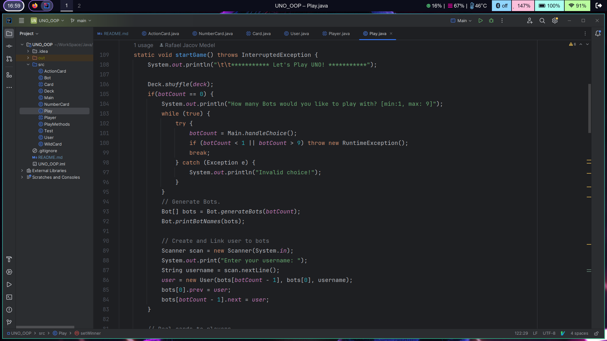

# Text-Based UNO Game (Java)

Welcome to the Text-Based UNO Game in Java! This is a simple command-line UNO game that you can play in your terminal. It's a fun and exciting way to enjoy the classic card game against bots without any graphical interface.

## Getting Started

### Prerequisites

Before you can start playing, make sure you have the following installed:

- Java Development Kit (JDK) (recommended version: JDK 17)
- Git (optional, for cloning the repository)

### Installation

1. Clone the repository (if you have Git) or download the source code as a ZIP file and extract it to your desired location.

   ```bash
   git clone https://github.com/rafaeljacov/Text-Based-UNO-Game-Java.git
   
2. Open the project using your favorite Java IDE of choice and run the program. (Make sure that you have set your Main class in your configurations)

Or

3. If you are a geek, compile and run the program yourself using the "javac" and "java" commands through the terminal.




## Classic UNO Rules

### Objective

The main objective of UNO is to be the first player to empty your hand of cards.

### Setup

1. UNO is typically played with 2 to 10 players.

2. The deck consists of 108 cards:
   - 19 Blue cards (0 to 9)
   - 19 Green cards (0 to 9)
   - 19 Red cards (0 to 9)
   - 19 Yellow cards (0 to 9)
   - 8 Draw Two cards (2 in each color)
   - 8 Reverse cards (2 in each color)
   - 8 Skip cards (2 in each color)
   - 4 Wild cards
   - 4 Wild Draw Four cards

3. Each player is dealt 7 cards. The remaining cards form the draw pile.

4. The top card from the draw pile is placed face-up to start the discard pile.


### Gameplay

1. Players take turns in a clockwise direction.

2. On your turn, you must play a card that matches either the color or the number of the card on the discard pile.

3. Special cards:
   - **Skip**: When played, the next player is skipped.
   - **Reverse**: The direction of play reverses.
   - **Draw Two**: The next player must draw 2 cards and forfeits their turn.
   - **Wild**: This card allows you to choose the next color to be played.
   - **Wild Draw Four**: This card not only allows you to choose the next color but also forces the next player to draw 4 cards and forfeit their turn. You can only play this card if you don't have a card that matches the color on the discard pile.

4. The game continues until one player empties their hand.

### Winning
The first player to play all their cards wins the game.
